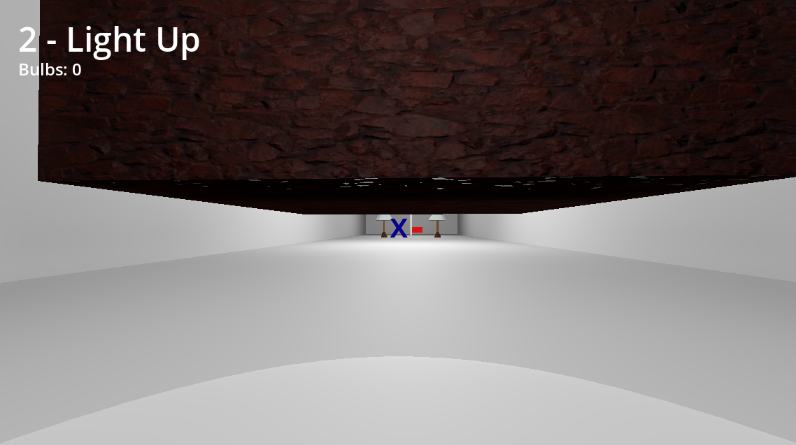

# Game Development - Tutorial 7

- **Name:** Feru Pratama Kartajaya
- **NPM:** 2106750351
- **Topic:** Basic 3D Game Mechanics & Level Design

---

## Latihan Mandiri: Eksplorasi Mechanics 3D

### Platforms and Kill Planes

Untuk mengisi struktur dari level, saya membuat dua macam objek: Platform dan Kill Plane. Platform merupakan landasan statis yang diletakkan mengambang di dalam level. Pemain dapat menginjak Platform dan menggunakannya untuk meloncat ke tempat lain di level maupun Platform lainnya.


Kill Plane merupakan sebuah area yang akan membunuh pemain saat ia menyentuhnya. Kill Plane dapat diletakkan di bawah jurang maupun melapisi objek lain yang berbahaya. Apabila pemain menyentuh Kill Plane, Death Screen akan tampil dan pemain dapat memilih opsi "Retry" untuk mengulang level.

```py
# KillPlane.gd
extends Area3D

var death_screen = load("res://scenes/DeathScreen.tscn")


func _on_body_entered(body: Node3D) -> void:
	if body.get_name() == "Player":
		body.kill()

		Input.set_mouse_mode(Input.MOUSE_MODE_VISIBLE)
		add_child(death_screen.instantiate())

		# Prevent further triggers
		set_deferred("monitoring", false)
```


### Sprint and Crouch

Terdapat dua aksi yang dapat mempengaruhi movement pemain: Sprinting dan Crouching. Kedua aksi tersebut akan menerapkan sebuah multiplier terhadap kecepatan pemain, dengan Sprint mempercepat laju pemain dan Crouch memperlambat laju pemain. Sprint dapat dilakukan dengan menahan key Shift saat pemain berjalan, sedangkan Crouch merupakan toggle dengan menekan key Q. Aksi Sprint dan Crouch bersifat ekslusif dan tidak dapat terjadi bersamaan.

```py
# Player.gd
@export var speed: float = 10.0
@export var sprint_multiplier: float = 1.3
@export var crouch_multiplier: float = 0.6

var is_crouching = false

func _physics_process(delta):
	if in_control:

		...

		if Input.is_action_just_pressed("crouch"):
			is_crouching = !is_crouching
			animation.play("Crouch Down" if is_crouching else "Crouch Up")

		var current_speed = speed
		if is_crouching:
			current_speed *= crouch_multiplier
		elif Input.is_action_pressed("sprint"):
			current_speed *= sprint_multiplier

		velocity.x = lerp(velocity.x, movement_vector.x * current_speed, acceleration * delta)
		velocity.z = lerp(velocity.z, movement_vector.z * current_speed, acceleration * delta)

        ...

        move_and_slide()
```

Selain memperlambat laju pemain, Crouch akan menyusutkan tinggi pemain seolah ia sedang jongkok. Dengan ukuran yang lebih pendek, pemain dapat melalui jalur yang lebih sempit. Terdapat animasi yang mendampingi aksi Crouch dengan posisi kamera yang lebih rendah dari biasanya.




### Lamps, Lightbulbs, and Inventories

Terdapat sebuah objek Lightbulb yang berbentuk seperti lampu pijar. Lightbulb dapat ditemukan mengambang di sekitar level. Apabila pemain menekan key E saat memandang sebuah Lightbulb, objek tersebut akan menghilang dari level dan tersimpan ke dalam Inventory. Inventory merupakan sebuah objek Global yang dapat menyimpan objek-objek yang diambil oleh pemain.

```py
# Inventory.gd
extends Node

var bulbs = 0
```

```py
# LightBulb.gd
extends Interactable


func interact():
	Inventory.bulbs += 1
	self.queue_free()
```


Saat berada di dalam level, Lightbulb memiliki animasi mengambang naik-turun secara perlahan. Animasi ini akan terus berjalan berulang kali.


Objek Lamp yang telah dibuat saat mengerjakan tutorial telah mengalami rework untuk menambahkan interaksi dengan sistem Inventory. Sekarang, Lamp bisa menyala dari awal atau mati terlebih dahulu. Apabila pemain menemukan Lamp yang mati, ia dapat berinteraksi dengan Lamp tersebut (key E) untuk menyalakannya. Namun, pemain hanya dapat menyalakan Lamp apabila ia memiliki setidaknya satu Lightbulb di dalam Inventory. Setelah Lamp nyala, jumlah Lightbulb dalam Inventory akan berkurang.

```py
# Lamp.gd
extends Interactable

@export var off_at_start: bool = false

@onready var head_on = $CSG/HeadOn
@onready var head_off = $CSG/HeadOff

var on: bool


# Called when the node enters the scene tree for the first time.
func _ready() -> void:
	on = true if !off_at_start else false
	_toggle_light()


func _toggle_light():
	head_on.visible = true if on else false
	head_off.visible = false if on else true


func interact():
	if Inventory.bulbs > 0 and !on:
		on = true
		_toggle_light()
		Inventory.bulbs -= 1
```


Terakhir, jumlah Lightbulb dalam Inventory akan reset ke 0 setiap kali level diload untuk alasan apapun (berpindah ke level berikutnya, mengulang dari kematian, dll.)

```py
# StartLevel.gd
extends Node3D


func _ready() -> void:
	Inventory.bulbs = 0

```

### Heads-Up Display

Di setiap level, terdapat sebuah HUD yang tampil di ujung kiri atas layar. HUD menampilkan informasi mengenai nama level yang dimainkan saat ini, serta jumlah Lightbulb yang tersimpan di inventory.

```py
# LevelHUD.gd
extends CanvasLayer

@export var level_name: String = "New Level"

@onready var level_label = $LevelLabel
@onready var bulb_counter = $BulbCounter


func _ready() -> void:
	level_label.text = level_name


func _process(_delta: float) -> void:
	bulb_counter.text = "Bulbs: " + str(Inventory.bulbs)

```


### End Goal Flag

Objek Flag menyiratkan akhir dari level. Flag berawal dalam posisi bendera di bawah palang. Flag dikelilingi oleh sebuah node Area3D yang akan mendeteksi mendekatnya pemain. Saat pemain cukup mendekati Flag, level berhasil dimenangkan dan pemain akan berpindah ke Scene selanjutnya. Sebelum berpindah, animasi dimainkan di mana bendera dinaikkan ke puncak palang.

```py
# Goal.gd
extends Area3D

@export var scene_name := "Level1"

@onready var animation: AnimationPlayer = $AnimationPlayer


func _on_body_entered(body: Node3D) -> void:
	if body.get_name() == "Player":
		body.disable_movement()
		animation.play("Flag Raise")
		await animation.animation_finished

		Input.set_mouse_mode(Input.MOUSE_MODE_VISIBLE)
		get_tree().call_deferred("change_scene_to_file", "res://scenes/" + scene_name + ".tscn")
```


## Assets

- Rock Wall 10 by Amal Kumar - [Poly Haven](https://polyhaven.com/a/rock_wall_10)
- LED Lightbulb by Simon Pasi - [Sketchfab](https://sketchfab.com/3d-models/led-lightbulb-af60d8dd58d5474ab45f6d2cdfd61d1c)

### Referensi dan Resources

- Tutorial's GitHub page: https://csui-game-development.github.io/tutorials/tutorial-7/
- Official Godot GDScript reference: https://docs.godotengine.org/en/stable/tutorials/scripting/gdscript/gdscript_basics.html
- Official Godot Engine forums: https://forum.godotengine.org/